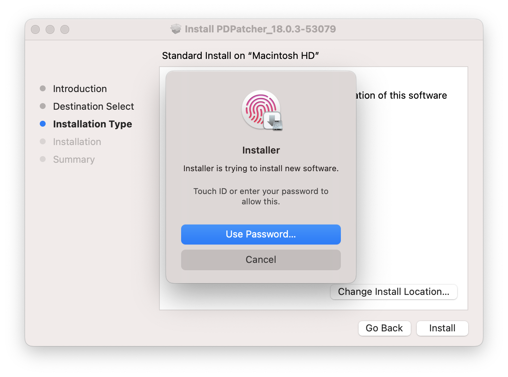

# 
<p align="center">

</p>
<h1 align="center">PD Patcher</h1>
<h3 align="center">v18.0.2</h3>
<h3 align="center">PD Runner 的修复工具</h3>
<p align="center">本项目仅用于学习研究使用</p>


## 运行截图
<p align="center"></p>  

## 使用
如果您的 Mac 具有 Touch ID，按下指纹即可授权，或输入密码以授权。

授权后，PD Patcher 将开始工作。工作完成后，将弹出 “Compelete!” 对话框。

## 手动构建 PD Patcher
需要 Python 3.5 以上版本。
```bash
python3 generate.py
```

## 常见问题
**1. 显示「无法打开“PDPatcher.app”，因为无法验证开发者。」怎么办？**  
> 右击 PDPatcher.app ，选择 “打开” ，然后点击 “打开” 按钮。  
> 或者，在「终端」中，执行 `xattr -r -d com.apple.quarantine PDPatcher.app`。  

**2. 运行 PDPatcher.app 后，没有任何窗口弹出？**  
> 在「活动监视器」中，手动退出 PD Patcher ，再次打开。  

**3. 使用 Touch ID 或密码授权后，没有任何动静？**  
> PD Patcher 此时正在后台处理工作。如果超过一分钟没有对话框弹出，请在「活动监视器」中，手动退出 PD Patcher ，然后再次打开。   

**4. PD Patcher 安全吗？**  
> PD Patcher 的源代码完全开放。您可以自行验证其安全性。  
